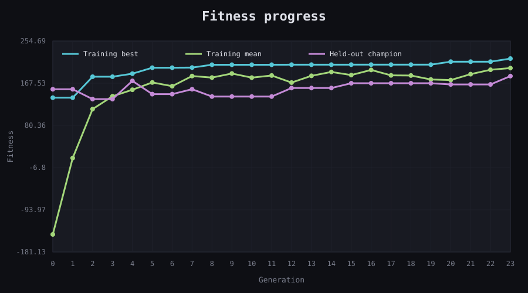
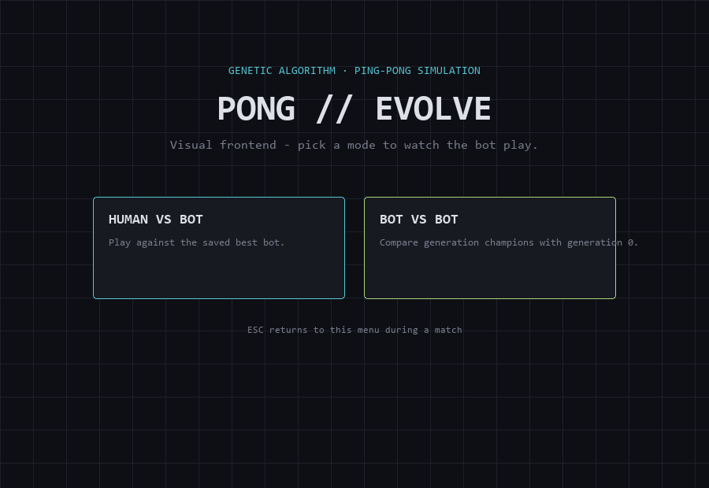
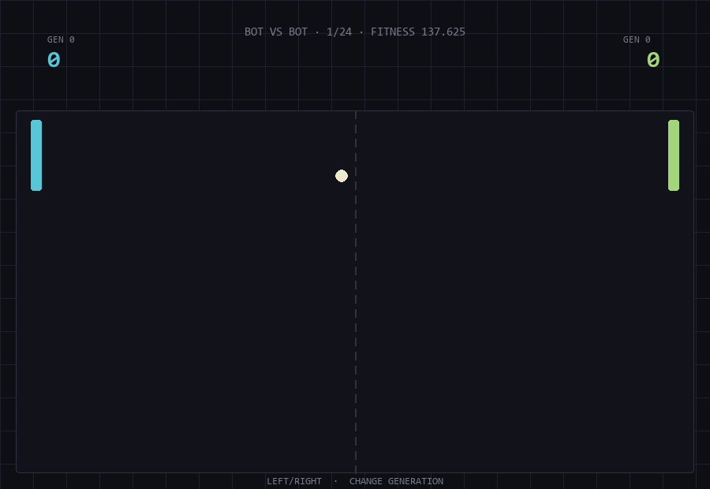
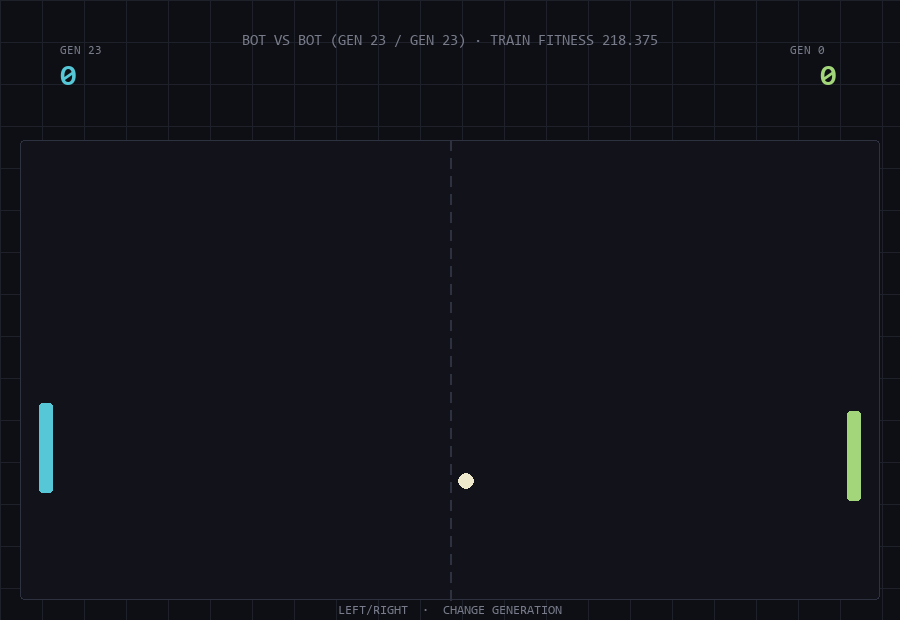

# AI Ping Pong

A deterministic ping-pong simulation in Python and Pygame where bots evolve through a genetic algorithm.

The project includes Human vs Bot and Bot vs Bot modes, headless training and match evaluation, reproducible generation history, a saved best bot, deterministic evidence, and generation-by-generation visual replay.

· [Русская версия](README_RU.md)

## 📋 TOC

- [🚀 Quick start](#-quick-start)
- [📝 About](#-about)
- [✨ Features](#-features)
- [🏗️ Architecture](#️-architecture)
- [🧬 Bot genome](#-bot-genome)
- [🧠 Genetic algorithm](#-genetic-algorithm)
- [📊 Fitness and evaluation](#-fitness-and-evaluation)
- [🕹️ Game modes and controls](#️-game-modes-and-controls)
- [🌐 Generation API](#-generation-api)
- [🧰 Technology stack](#-technology-stack)
- [🧪 Tests](#-tests)
- [📁 Project structure](#-project-structure)
- [⚠️ Notes](#️-notes)
- [🧑‍💻 Author](#-author)

## 🚀 Quick start

### Prerequisites

- Python `3.13` or another version compatible with Pygame `2.6.1`
- a virtual environment is recommended

### Clone and install

#### Windows (Git Bash)

```bash
git clone https://01.tomorrow-school.ai/git/nyestaye/ai-ping-pong
cd ai-ping-pong

python -m venv .venv
source .venv/Scripts/activate
python -m pip install -r requirements.txt
```

#### macOS / Linux

```bash
git clone https://01.tomorrow-school.ai/git/nyestaye/ai-ping-pong
cd ai-ping-pong

python3 -m venv .venv
source .venv/bin/activate
python -m pip install -r requirements.txt
```

The commands below use Bash syntax and work in Git Bash on Windows and in the standard terminal on macOS or Linux after the virtual environment is activated.

### Run the game

```bash
python -m game.main
```

Direct script execution is also supported:

```bash
python game/main.py
```

## 📝 About

AI Ping Pong is an educational project that demonstrates how a genetic algorithm can optimize bot behavior in a simple deterministic game environment.

The visual frontend is separated from the match simulation. The same simulation can therefore run:

- interactively through Pygame;
- headlessly during training;
- headlessly during deterministic evaluation;
- without opening a display during automated tests.

Training is performed separately from the GUI. The frontend loads committed artifacts:

```text
models/best_bot.json
logs/generations.csv
```

Human vs Bot uses the saved global best genome. Bot vs Bot can replay any two generation champions independently.

## ✨ Features

### Gameplay

- Human vs Bot mode;
- Bot vs Bot mode;
- mouse and keyboard control for the human paddle;
- independent left/right generation selection with mouse or keyboard;
- manual ball-speed and paddle-size controls;
- optional automatic gradual difficulty every 20 seconds;
- score tracking and paddle/ball collision handling;
- adaptive physics substeps that prevent fast balls from tunneling through paddles;
- deterministic headless matches.

### Bot evolution

- random initial population;
- parameterized bot genome;
- tournament selection;
- per-gene blend crossover;
- per-gene Gaussian mutation;
- direct elitism;
- configurable population, generation count, mutation, crossover, seeds, and match limits;
- deterministic evolution through an isolated random generator;
- saved best bot in JSON;
- canonical generation history in CSV.

### Evidence and reproducibility

- best, mean, and worst fitness for every generation;
- held-out deterministic evaluation;
- final champion compared directly with generation `0`;
- committed JSON evaluation report;
- deterministic SVG fitness chart;
- reproducible frontend screenshots;
- canonical training and evaluation seeds documented below.

### Implemented bonuses

- read-only generation and fitness API;
- manual and automatic gradual difficulty;
- best bot persistence in JSON.

## 🏗️ Architecture

```text
                    +----------------------+
                    |   Pygame frontend    |
                    |     game/main.py     |
                    +----------+-----------+
                               |
                               v
                    +----------------------+
                    |  MatchSimulation     |
                    | game/simulation.py   |
                    +----------+-----------+
                               |
              +----------------+----------------+
              |                                 |
              v                                 v
    +-------------------+             +-------------------+
    | HumanController   |             | BotController     |
    | keyboard / mouse  |             | genome-driven     |
    +-------------------+             +-------------------+

    +-----------------------------------------------------+
    | Headless training and evaluation                    |
    | ga/genetic_algorithm.py -> ga/fitness.py            |
    |                           -> game/match_runner.py    |
    +-----------------------------------------------------+

    +-----------------------------------------------------+
    | Read-only generation API                            |
    | api/app.py -> ga/artifacts.py -> generations.csv    |
    +-----------------------------------------------------+
```

The core game state is independent from the display. Training and evaluation use the same simulation and controller behavior as the visual frontend. Runtime difficulty belongs only to the visual `Game` through `game/difficulty.py`; `MatchSimulation` remains unaware of UI controls and automatic timing. The API is also independent from Pygame and only reads the canonical generation history through the existing artifact loader.

## 🧬 Bot genome

Each bot is represented by three parameters:

| Parameter            | Meaning                                            |
|----------------------|----------------------------------------------------|
| `paddle_speed`       | maximum paddle movement speed in pixels per second |
| `reaction_time`      | delay between target updates                       |
| `movement_threshold` | dead zone around the target position               |

Canonical promoted genome:

```text
paddle_speed       = 420.0
reaction_time      = 0.039498692275418835
movement_threshold = 29.790193846648812
```

The controller updates its target from the ball position according to `reaction_time`, then moves toward that target using `paddle_speed` and `movement_threshold`.

## 🧠 Genetic algorithm

Run deterministic headless training:

```bash
python -m ga.genetic_algorithm
```

Example with a smaller custom run:

```bash
python -m ga.genetic_algorithm \
    --population-size 8 \
    --generations 3
```

Direct script execution is also supported:

```bash
python ga/genetic_algorithm.py --population-size 8 --generations 3
```

### Default CLI parameters

- Evolution seed: `20260728`
- Population size: `16`
- Evaluated generations: `8`
- Elite count: `2`
- Tournament size: `3`
- Crossover rate: `0.8`
- Mutation rate: `0.2`
- Mutation sigma: `0.10`
- Match seeds: `20260728,20260729`
- Match limit: `1800` steps or `3` points
- Baseline opponent: `260,0,8`
- Score weight: `100.0`
- Return weight: `1.0`

### Canonical training run

The committed model and history were produced with:

- Evolution seed: `20260730`
- Population size: `32`
- Evaluated generations: `24`
- Elite count: `4`
- Tournament size: `4`
- Crossover rate: `0.8`
- Mutation rate: `0.2`
- Mutation sigma: `0.1`
- Training seeds: `2000,2001,2002,2003,2004,2005,2006,2007`
- Match limit: `3600` steps or `5` points
- Baseline opponent: `260,0,8`
- Score weight: `100.0`
- Return weight: `1.0`

The training command writes:

```text
logs/generations.csv
models/best_bot.json
```

Use custom paths with:

```bash
python -m ga.genetic_algorithm \
    --log-path custom/generations.csv \
    --model-path custom/best_bot.json
```

## 📊 Fitness and evaluation

For one match, candidate fitness is calculated as:

```text
score_weight * (candidate_score - opponent_score)
    + return_weight * candidate_returns
```

Each candidate plays on both sides for every configured seed. Final fitness is the arithmetic mean across all matches.

The canonical CSV stores:

```text
generation
best_fitness
mean_fitness
worst_fitness
paddle_speed
reaction_time
movement_threshold
```

### Canonical result

| Metric                | Generation 0   | Generation 23     | Result         |
|-----------------------|---------------:|------------------:|---------------:|
| Training mean fitness | -144.814453125 | 198.83984375      | +343.654296875 |
| Held-out fitness      | 155.05         | 182.225           | +27.175        |
| Final vs initial      | —              | 13 W / 27 D / 0 L | 13:0 points    |

Run the locked deterministic evaluation:

```bash
python -m ga.evaluation
```

The evaluation uses held-out seeds `1000..1019`, which were not used during training. Every genome plays once on the left and once on the right for each seed.

Artifacts:

- [Full deterministic evaluation report](reports/evaluation.json)
- [Fitness progress chart](docs/fitness_progress.svg)



A visual replay is useful for inspection, but the numerical evaluation report is the formal evidence of improvement.

## 🕹️ Game modes and controls

### Human vs Bot

The human player controls the left paddle. The right paddle uses the saved global best genome from:

```text
models/best_bot.json
```

Controls:

- mouse inside the court;
- `W` / `S`;
- up / down arrow keys;
- clickable runtime-difficulty controls;
- `Esc` returns to the menu.

### Bot vs Bot

The left and right sides independently load any champion available in `logs/generations.csv`. Both start at generation `0`.

Controls:

- `A` / `D` change LEFT GEN;
- left / right arrow keys change RIGHT GEN;
- the arrow buttons beside each bot provide the same controls;
- `Esc` returns to the menu.

### Runtime difficulty

Runtime difficulty is available in both game modes through the clickable bottom panel and keyboard shortcuts:

- `-` / `+` or numpad `-` / `+` changes ball speed;
- `[` / `]` changes both paddle heights;
- `T` toggles automatic gradual difficulty.

| Setting       | Minimum | Default | Maximum  | Step   |
|---------------|--------:|--------:|---------:|-------:|
| Ball speed    | `x0.50` | `x1.00` | `x2.00`  | `0.10` |
| Paddle height | `50 px` | `90 px` | `120 px` | `5 px` |

AUTO is ON by default. Every 20 seconds of active match time it adds `0.10` to ball speed and removes `5 px` from paddle height, independently clamped to the limits above. Turning AUTO off pauses its timer; turning it back on resumes from the saved remainder. Manual changes do not restart that timer.

Changing difficulty preserves the score, current rally, entity positions, and controllers. Paddle resizing preserves each center before clamping it to the court. A goal preserves difficulty, and the next serve uses the current speed multiplier. A real generation change or entering a new mode resets the match and difficulty; pressing a disabled generation boundary control changes nothing.

Training fitness values were produced under the canonical default environment: ball speed `x1.00` and paddle height `90 px`, without runtime difficulty adjustments. `TRAIN FITNESS` ranks generation champions only under those training conditions.

Manual or automatic difficulty changes create an out-of-training stress-test environment. Because genome parameters such as `movement_threshold` are absolute pixel values, changing ball speed or paddle height can change the relative performance of generations. An earlier generation may therefore beat a later generation under custom difficulty settings without contradicting the recorded training progress.

For a like-for-like generation comparison, use ball speed `x1.00`, paddle height `90 px`, and set AUTO to OFF.

Screenshots:







Regenerate them with:

```bash
python -m tools.capture_screenshots
```

## 🌐 Generation API

The FastAPI service provides read-only access to the current generation and fitness history. It does not start the genetic algorithm, change the game, or write to `logs/generations.csv`. The selected CSV is loaded again for every data request, so a completed training run becomes visible without restarting the server.

Start the local server:

```bash
python -m api.main
```

Direct script execution is also supported:

```bash
python api/main.py
```

Swagger UI is available at [http://127.0.0.1:8000/docs](http://127.0.0.1:8000/docs).

| Method | Endpoint                    | Response                                         |
|--------|-----------------------------|--------------------------------------------------|
| `GET`  | `/`                         | API name, read-only status, source, and docs URL |
| `GET`  | `/health`                   | service health without reading the CSV           |
| `GET`  | `/generations`              | all generation records including genomes         |
| `GET`  | `/generations/{generation}` | one generation record                            |
| `GET`  | `/fitness`                  | fitness history without genomes                  |

Example requests:

```bash
curl -s http://127.0.0.1:8000/generations
curl -s http://127.0.0.1:8000/generations/23
curl -s http://127.0.0.1:8000/fitness
```

Use another generation log:

```bash
python -m api.main \
    --generations-path custom/generations.csv
```

Without this option the API uses the canonical project-root `logs/generations.csv`. An explicitly supplied relative path is resolved from the invocation working directory; an absolute path is used unchanged. The default host is `127.0.0.1` and the default port is `8000`.

## 🧰 Technology stack

| Layer           | Technology                          |
|-----------------|-------------------------------------|
| Language        | Python                              |
| Visual frontend | Pygame `2.6.1`                      |
| Read-only API   | FastAPI `0.139.2`, Uvicorn `0.51.0` |
| Simulation      | custom deterministic 2D physics     |
| Evolution       | custom genetic algorithm            |
| Artifacts       | JSON, CSV, SVG, PNG                 |
| Tests           | Python `unittest`                   |

No external dataset is used. Training data is generated by deterministic simulated matches.

## 🧪 Tests

Run all tests:

```bash
python -m unittest discover -s tests -v
```

Additional checks:

```bash
python -m compileall api game ga tools tests
python -m pip check
```

The test suite covers:

- simulation and collision behavior;
- large-step and sub-30px tunneling regressions;
- bot and human controllers;
- deterministic match execution;
- genome validation;
- selection, crossover, and mutation;
- fitness aggregation;
- genetic algorithm evolution;
- CSV and JSON artifacts;
- CLI path and error behavior;
- deterministic evaluation;
- SVG generation;
- screenshot capture;
- frontend integration;
- runtime difficulty and independent generation controls;
- read-only API endpoints, reload behavior, errors, paths, and CLI;
- edge cases and reproducibility.

## 📁 Project structure

```text
ai-ping-pong/
├── api/
│   ├── app.py
│   └── main.py
├── docs/
│   ├── fitness_progress.svg
│   └── screenshots/
├── game/
│   ├── ball.py
│   ├── controllers.py
│   ├── difficulty.py
│   ├── main.py
│   ├── match_runner.py
│   ├── paddle.py
│   ├── simulation.py
│   └── utils.py
├── ga/
│   ├── artifacts.py
│   ├── crossover.py
│   ├── evaluation.py
│   ├── fitness.py
│   ├── genetic_algorithm.py
│   ├── genome.py
│   ├── mutation.py
│   └── selection.py
├── logs/
│   └── generations.csv
├── models/
│   └── best_bot.json
├── reports/
│   └── evaluation.json
├── tests/
├── tools/
│   └── capture_screenshots.py
├── requirements.txt
├── README.md
└── README_RU.md
```

## ⚠️ Notes

- Training is separate from the visual game and does not run in the background during gameplay.
- Human vs Bot always loads the committed best bot unless another model path is supplied.
- Bot vs Bot replays generation champions; it does not retrain them.
- `TRAIN FITNESS` in the HUD is the historical training fitness of the selected generation champion, not the current match score.
- Generation numbering starts from `0`, so a 24-generation history contains generations `0..23`.
- Manual and automatic gradual difficulty are implemented visual-game bonuses and do not alter canonical training or evaluation.
- The baseline genome `260,0,8` is used for training and evaluation; it is not the default Human vs Bot opponent.
- The committed JSON model is the implemented best-bot persistence bonus.
- The generation/fitness API is an implemented read-only bonus and never writes training artifacts.

## 🧑‍💻 Author
Nazar Yestayev (@nyestaye)
